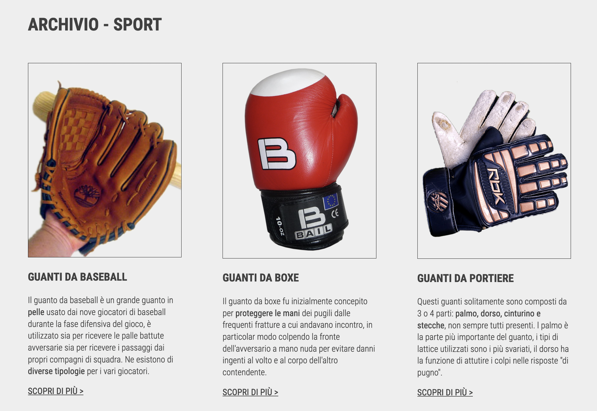
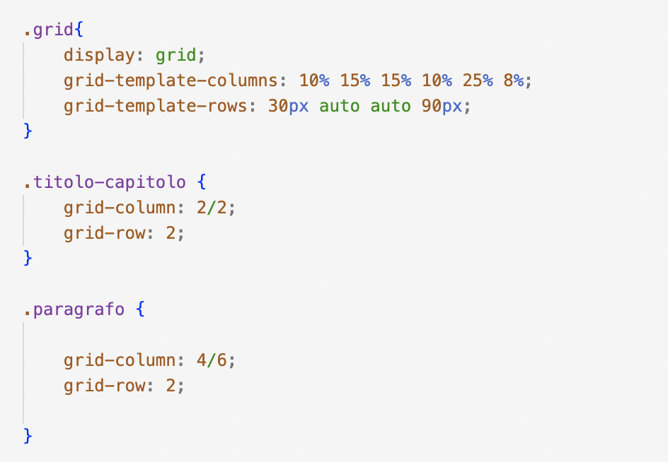

SUPSI 2022-23  
Corso d’interaction design, CV427.01  
Docenti: A. Gysin, G. Profeta  

Elaborato 2: Antologia a due mani  

# Titolo progetto
Autore: Hans Manon  
[MediaPipe demo-ES6](https://ixd-supsi.github.io/2023/esempi/mp_hands/es6/1_landmarks)

## Introduzione e tema
Il compito assegnato era quello di realizzare una ricerca testuale e iconografica per raccontare l’aspetto, la funzionalità e la storia dell'oggetto da noi scelto, legato all'utilizzo della mano. 
Il tema che ho deciso di trattare riguarda i guanti, per tanto ho inizialmente fatto una ricerca sulla storia e le orgigine dell'oggetto, incrementando le informazioni attraverso immagini e catalogazioni. 

## Riferimenti progettuali
Per quanto riguarda la sezione dedicata all'archivio, mi sono ispirata al  layout della magina web "Mousse Magazine", dato l'utilizzo di una griglia per racchiudere le varie riviste.

https://www.moussemagazine.it/

## Design dell’interfraccia e modalià di interazione
Il sito che ho realizzato è principalmente statico. Nella parte iniziale della pagine è presente la barra di navigazione, con i titoli delle sezioni che si troveranno successivamente.  

 
 In questo caso, schiacciando la categoria desiderata, il sito scorrerà alla parte corrispondente. Di seguito si trova l'archivio, suddiviso in tre macro categorie, contiene immagini, titolo, e descrizione del guanto rappresentato.
 

 

Nella parte ingeriore della pagine è presente il footer.

## Tecnologia usata
Il sito è stato realizzato tramite il codice HTML e CSS.
Nell'HTML ho inserito tutti gli elementi, utilizzanddo i classici tag come "h1" per i titoli, "p" per i paragrafi e via dicendo, mentre con il CSS ho potuto modificarli in base alle mie esigenze.
Per la suddivisione in colonne ho utilizzato il tag CSS "display: grid", così da mantenere spazio ai lati del titolo e del testo.  

## Target e contesto d’uso
Quesato sito è destinato a sia a coloro interessati al tema trattato ma anche a chi vorrebbe sapere quante tipologie di guanti esistono e le caratteristiche principali di quest'ultimi. I contesti di utilizzo possono variare, infatti il sito si può utilizzare sia per interesse personale ma anche come enciclopedia per ricerche o informazioni.

